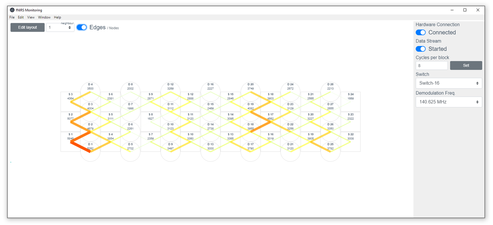

# fNIRS real-time data analysis tool



## Details

- [Presentation (PDF)](report/presentation.pdf)  
- [Dissertation (PDF)](report/report.pdf)  
- [Electron & Vue.js Template](https://github.com/johndab/electron.net-vue)

## Prerequisites
- Node.js
- .NET Core SDK 3.1

## How to run

1. Start Imagent DMC
2. Install `ElectronNET.CLI` tool:
```
dotnet tool install ElectronNET.CLI -g
```
3. In /UI run:
```
npm install
```
4. Finally, in the root folder run 
```
electronize start
```